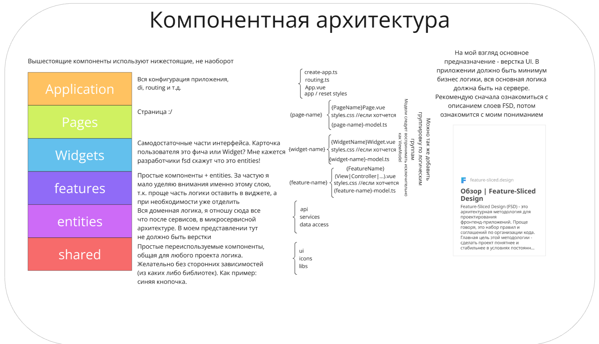

Тестовое задание в ИНБРЭС "Простой редактор фигур".
----------------------------
#### Используемый стэк:
1. Технологии и фреймворки: .net9 или выше, C#13 или выше, Avalonia UI, Reactive UI или CommunityToolkit.Mvvm;
2. Архитектурные паттерны: [MVVM](https://www.youtube.com/watch?v=T2zovvglVZw), [FSD](https://feature-sliced.github.io/documentation/ru/docs/get-started/overview), [Clean Architecture](https://www.youtube.com/watch?v=WlCDcr8JYFU);
3. Рекомендуем Использовать [HotAvalonia](https://github.com/Kira-NT/HotAvalonia) для горячей перезагрузки axaml.

## Основное задание.
Требуется разработать редактор фигур на Avalonia UI, для реализации выбрать один примитив и одну кривую из предлагаемых фигур.

Особенность примитивов в том, что они состоят из фиксированного числа точек, в свою очередь количество опорных точек в кривой линии может изменяться, необходимо предусмотреть возможность добавления новых точек в кривую линию на момент ее создания. Аналогично примитивам необходима возможность изменения их размеров хотя бы на момент создания фигуры.

Необходимо реализовать функцию восcтановления состаяния сериализовав ViewModel или Model фигур в JSON. Для сериализации необходимо использовать System.Text.Json. В сериализуемые данные не должны попадать Control'ы Avalonia Ui. Сериализация структур Point, Color, Thickness, а так же иных классов не наследующихся от Сontrol вполне допустима. 

Для простоты реализации фигур можно использовать [Path](https://docs.avaloniaui.net/ru/docs/guides/graphics-and-animation/graphics-and-animations) либо отрисовывать через [DrawingContext.DrawGeometry](https://reference.avaloniaui.net/api/Avalonia.Media/DrawingContext/E76A87CD). PathGeometry уже имеет функционал для отрисовки кривых Безье, можно ореинтироваться на документацию по [svg](https://developer.mozilla.org/ru/docs/Web/SVG/Tutorials/SVG_from_scratch/Paths) path, их синтаксис довольно схож.

#### Предлагаемые фигуры:
1. Примитивы: Прямоугольник, Овал, Треугольник.
2. Кривые: Квадратичная кривая Безье, Кубическая кривая Безье.

## Требование к решению:

####  Версионирование.
1. Необходимо сделать форк данного репозитория и разместить свое решение в нем.
2. По мере реализации фич необходимо делать фиксации в git.
3. Коммиты должны иметь [осмысленное содержание](https://habr.com/ru/companies/yandex/articles/431432/), кратко характеризующее изменение.
4. После завершения тестового задания необходимо предложить слияние в [родительский репозиторий](https://github.com/Andreev-Da/Inbres.TestWork.ShapeEditor).

#### Структура решения.
1. sln файл должен располагаться в [корневой директории](.), а сами проекты в директории [Source](Source)
2. Решение необходимо поделить минимум на два проекта, один с исходным кодом редактора, второй с запускаемым приложением (см. [создание пользовательских библиотек](https://docs.avaloniaui.net/ru/docs/guides/custom-controls/how-to-create-a-custom-controls-library)).
3. Редактор должен интегрироваться в запускаемое приложение как UserControl или TemplatedControl (на ваш выбор).

#### Требования к коду.
1. Необходимо использовать [соглашения по наименованию от Microsoft.](https://learn.microsoft.com/ru-ru/dotnet/standard/design-guidelines/general-naming-conventions)
2. Код должен быть [Native AOT](https://learn.microsoft.com/en-us/dotnet/core/deploying/native-aot/?tabs=windows%2Cnet8) совместим.
    Для сохранения горячей перезагрузки, флаг PublishAot устанавливается только на этапе публикации решения, поэтому для получения предупреждений от компилятор в csproj необходимо добавить флаг IsAotCompatible.
3. Для реализации привязки данных необходимо использовать ReactiveUI либо CommunityToolkit.Mvvm.

#### Архитектурные требования.
1. При создании компонентов редактора необходимо ориентироваться на практику MVVM и методологию [FSD](https://feature-sliced.github.io/documentation/ru/docs/get-started/overview), так как проект не особо сложный предлагается следующая файловая структура без деления на сегменты (ui, model и т.п.):
    Пример расположение компонента ShapesEditorWidget: \Widgets\ShapesEditor\ShapesEditorWidget.axaml
    Для его ViewModel расположение будет схожим: \Widgets\ShapesEditor\ShapesEditorWidgetModel.cs

ShapeVi

#### Публикация
1. Решение должно быть собрано c флагом Native AOT в конфигурации Release под linux и windows, после чего размешено в github Releases вашего репозитория.
     `dotnet publish -p:PublishAot=true -r win-x64 -c Release`
     `dotnet publish -p:PublishAot=true -r linux-arm64 -c Release`

## Рекомендуемые материалы:
1. [Кодируем: Clean Architecture Ультимативно (чистая архитектура проекта любого размера, принципы, мышление)](https://www.youtube.com/watch?v=WlCDcr8JYFU)
2. [Unitist Notes: Model View ViewModel, Модель Вид Модель Вида, Unity, C#](https://www.youtube.com/watch?v=T2zovvglVZw);
3. [Документация Авалонии](https://docs.avaloniaui.net/)

## Пример решения: 

_\*От вас не требуется весь представленный функционал._

 Описание данной реализации.

_\*Это одна из возможных реализаций. Следовать ей не обязательно — достаточно продемонстрировать понимание принципов MVVM и чистой архитектуры._

Каждая фигура реализует общий интерфейс IShape. По своей сути конкретная реализация фигур получились ближе к ViewModel, т.к. они реализуют интерфейс INotifyPropertyChanged, что позволяет уведомлять UI об изменениях состояния фигуры.

Для каждой фигуры предусмотрена соответствующая View. Сопоставление ViewModel и View осуществляется с помощью [ViewLocator](https://docs.avaloniaui.net/docs/concepts/view-locator).

Поле, на котором отображаются фигуры, реализовано как ItemsControl. В качестве ItemsPanel используется обычная Panel. Такой подход упрощает отрисовку кривых Безье: элемент Path занимает всё доступное пространство и выступает в роли холста для отдельной фигуры.
Однако это накладывает определённые ограничения —   даже простые примитивы должны быть представлены через Path, либо через связку из Canvas + Primitive. 

\*Стоит заметить, что Avalonia не обрабатывает нажатия на прозрачные (Transpanet) области, благодоря чему остается возможность отслеживать нажатия на отдельные фигуры.

Логика создания фигур вынесена в отдельные классы-строители, которые обрабатывают события нажатия и перемещения указателя по полю.
После нажатия на кнопку Add создаётся экземпляр соответствующего строителя. При первом клике на поле строитель создаёт новую фигуру (IShape) в указанной точке и добавляет её в общий пул фигур (ObservableCollection\<IShape\>), после чего та отображается на экране.
Ссылка на созданную фигуру до отмены операции сохраняется внутри строителя, который продолжает отслеживать действия пользователя и либо задаёт размеры примитива, либо (в случае кривых Безье) добавляет новые точки к фигуре.

